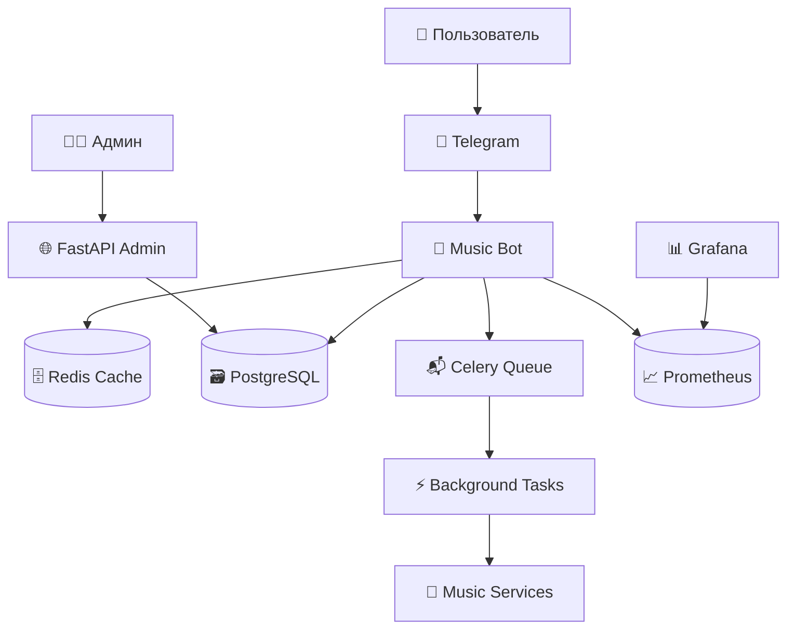

# 🎵 Music Universe Bot

Полнофункциональный музыкальный бот для Telegram с современной архитектурой, админ-панелью и монетизацией.

[](https://www.python.org/downloads/)
[](https://fastapi.tiangolo.com/)
[](https://docs.aiogram.dev/)
[](https://docs.docker.com/compose/)

## 📋 Содержание

- [Особенности](#-особенности)
- [Архитектура](#️-архитектура)
- [Быстрый старт](#-быстрый-старт)
- [Установка](#-установка)
- [Конфигурация](#️-конфигурация)
- [Запуск](#-запуск)
- [API документация](#-api-документация)
- [Мониторинг](#-мониторинг)
- [Разработка](#️-разработка)
- [Тестирование](#-тестирование)
- [Деплой](#-деплой)

## ✨ Особенности

### 🎵 Музыкальные возможности
- **Мультиисточники**: VK Audio, YouTube Music, Spotify метаданные
- **Высокое качество**: до 320kbps для Premium пользователей
- **Умный поиск**: автокомплит, исправление опечаток, рекомендации
- **Плейлисты**: создание, редактирование, совместный доступ
- **Inline режим**: поиск музыки прямо в чатах

### 💼 Бизнес-функции
- **Монетизация**: Telegram Stars + CryptoBot
- **Premium подписка**: расширенные возможности и лимиты
- **Аналитика**: детальная статистика пользователей и контента
- **A/B тестирование**: оптимизация конверсии

### 🛠️ Техническая часть
- **Микросервисная архитектура**: легкое масштабирование
- **Современный стек**: Python 3.12, FastAPI, aiogram 3.13
- **Production-ready**: Docker, мониторинг, логирование
- **Высокая производительность**: Redis кеширование, async/await

## 🏗️ Архитектура



### Компоненты системы

- **Bot Application** - Основной Telegram бот (aiogram)
- **Admin API** - FastAPI админ-панель
- **Background Workers** - Celery для фоновых задач
- **PostgreSQL** - Основная база данных
- **Redis** - Кеш, сессии, очереди
- **ClickHouse** - Аналитика и метрики
- **MeiliSearch** - Полнотекстовый поиск
- **MinIO** - S3-совместимое файловое хранилище

## 🚀 Быстрый старт

### Предварительные требования

- Docker & Docker Compose
- Git
- Telegram Bot Token ([создать бота](https://t.me/BotFather))

### 1. Клонирование репозитория

```bash
git clone https://github.com/your-org/music-universe-bot.git
cd music-universe-bot
```

### 2. Настройка окружения

```bash
# Копируем пример конфигурации
cp .env.example .env

# Редактируем переменные окружения
nano .env
```

### 3. Запуск всей инфраструктуры

```bash
# Запуск всех сервисов
docker-compose up -d

# Просмотр логов
docker-compose logs -f bot
```

### 4. Проверка работоспособности

- **Бот**: http://localhost:8000/health
- **API**: http://localhost:8001/docs
- **Grafana**: http://localhost:3000 (admin/admin)
- **Prometheus**: http://localhost:9090

## 🔧 Установка

### Опция 1: Docker (рекомендуется)

```bash
# Полная установка с мониторингом
docker-compose up -d

# Только основные сервисы
docker-compose up -d postgres redis bot api
```

### Опция 2: Локальная разработка

```bash
# Установка зависимостей
pip install poetry
poetry install

# Установка внешних сервисов
docker-compose up -d postgres redis minio

# Миграции базы данных
poetry run alembic upgrade head

# Запуск бота
poetry run python -m app.bot.main

# Запуск API (в другом терминале)
poetry run uvicorn app.api.main:app --reload
```

## ⚙️ Конфигурация

### Основные переменные окружения

```bash
# === ОБЯЗАТЕЛЬНЫЕ ===
BOT_TOKEN=1234567890:AABBCCDDEEFFGGHHIIJJKKLLMMNNOOPPQQrr
POSTGRES_PASSWORD=secure_password
REDIS_PASSWORD=secure_redis_password
SECRET_KEY=your-super-secret-key-here
ADMIN_API_KEY=your-admin-api-key

# === МУЗЫКАЛЬНЫЕ СЕРВИСЫ ===
VK_API_TOKEN=your-vk-token                # VK Audio доступ
SPOTIFY_CLIENT_ID=your-spotify-id         # Spotify метаданные
SPOTIFY_CLIENT_SECRET=your-spotify-secret
YOUTUBE_API_KEY=your-youtube-key          # YouTube Data API

# === ПЛАТЕЖИ ===
CRYPTOBOT_API_TOKEN=your-cryptobot-token  # Криптоплатежи
TELEGRAM_STARS_ENABLED=true               # Telegram Stars

# === ДОПОЛНИТЕЛЬНЫЕ ===
WEBHOOK_URL=https://yourdomain.com        # Для production
ENVIRONMENT=production                     # development/production
DEBUG=false                               # Отладка
```

### Структура конфигурации

Все настройки находятся в `app/core/config.py` с валидацией через Pydantic:

- **Базовые настройки** - проект, версия, окружение
- **Telegram** - токены, webhook, лимиты
- **Базы данных** - PostgreSQL, Redis, ClickHouse
- **Музыкальные сервисы** - API ключи и настройки
- **Безопасность** - токены, шифрование, rate limiting
- **Мониторинг** - Prometheus, логирование

## 🎯 Запуск

### Production (Docker)

```bash
# Запуск всей инфраструктуры
make up

# Остановка
make down

# Просмотр логов
make logs

# Мониторинг состояния
make status
```

### Development

```bash
# Запуск зависимостей
make dev-deps

# Запуск бота в режиме разработки
make dev-bot

# Запуск API
make dev-api

# Запуск воркеров
make dev-worker
```

### Полезные команды

```bash
# Миграции базы данных
make migrate

# Создание миграции
make migration name="your_migration_name"

# Бэкап базы данных
make backup

# Восстановление из бэкапа
make restore

# Запуск тестов
make test

# Проверка кода
make lint

# Форматирование кода
make format
```

## 📚 API документация

### FastAPI Admin API

После запуска API доступна интерактивная документация:

- **Swagger UI**: http://localhost:8001/docs
- **ReDoc**: http://localhost:8001/redoc
- **OpenAPI Schema**: http://localhost:8001/openapi.json

### Основные эндпоинты

```bash
# Аутентификация
POST /api/v1/auth/login
POST /api/v1/auth/refresh

# Пользователи
GET  /api/v1/users/
GET  /api/v1/users/{user_id}
PUT  /api/v1/users/{user_id}
DELETE /api/v1/users/{user_id}

# Аналитика
GET /api/v1/analytics/users
GET /api/v1/analytics/content
GET /api/v1/analytics/payments

# Рассылки
POST /api/v1/broadcast/
GET  /api/v1/broadcast/history
```

### Авторизация API

```bash
# Получение токена
curl -X POST "http://localhost:8001/api/v1/auth/login" \
  -H "X-API-Key: your-admin-api-key"

# Использование токена
curl -X GET "http://localhost:8001/api/v1/users/" \
  -H "Authorization: Bearer your-jwt-token"
```

## 📊 Мониторинг

### Grafana Dashboard

1. Открыть http://localhost:3000
2. Войти (admin/admin)
3. Импортировать дашборды из `monitoring/grafana/dashboards/`

### Основные метрики

- **Bot Performance**: RPS, latency, errors
- **Business Metrics**: DAU, revenue, conversions
- **Infrastructure**: CPU, memory, disk, network
- **Application**: database connections, cache hit rate

### Алерты

Настроенные алерты в Prometheus:

- High error rate (>5%)
- Database connection issues
- Memory usage >80%
- Disk space <10%

### Логирование

Логи доступны в нескольких форматах:

```bash
# Структурированные JSON логи
docker-compose logs -f bot | jq .

# Текстовые логи для разработки
tail -f logs/app.log

# Только ошибки
tail -f logs/error.log
```

## 🛠️ Разработка

### Настройка окружения разработчика

```bash
# Клонирование и установка
git clone https://github.com/your-org/music-universe-bot.git
cd music-universe-bot
poetry install

# Pre-commit хуки
poetry run pre-commit install

# Настройка IDE (VSCode)
cp .vscode/settings.example.json .vscode/settings.json
```

### Структура проекта

```
app/
├── core/           # Ядро системы (config, db, logging)
├── models/         # SQLAlchemy модели
├── schemas/        # Pydantic схемы
├── services/       # Бизнес-логика
├── bot/           # Telegram bot handlers
├── api/           # FastAPI endpoints
├── tasks/         # Celery background tasks
└── utils/         # Общие утилиты
```

### Стиль кода

Проект использует:
- **Black** для форматирования
- **isort** для импортов
- **flake8** для линтинга
- **mypy** для типизации

```bash
# Автоформатирование
make format

# Проверка стиля
make lint

# Проверка типов
make mypy
```

### Добавление новых функций

1. **Создать ветку**: `git checkout -b feature/new-feature`
2. **Модели**: Добавить в `app/models/`
3. **Схемы**: Добавить в `app/schemas/`
4. **Сервисы**: Добавить в `app/services/`
5. **Handlers**: Добавить в `app/bot/handlers/`
6. **Тесты**: Добавить в `tests/`
7. **Миграция**: `make migration name="add_new_feature"`

## 🧪 Тестирование

### Запуск тестов

```bash
# Все тесты
make test

# Только unit тесты
pytest tests/unit/

# Только integration тесты
pytest tests/integration/

# С покрытием
pytest --cov=app --cov-report=html
```

### Типы тестов

- **Unit тесты** - отдельные функции и методы
- **Integration тесты** - взаимодействие компонентов
- **API тесты** - HTTP endpoints
- **Bot тесты** - Telegram handlers

### Тестовые данные

```bash
# Создание тестовой БД
make test-db

# Загрузка фикстур
make test-fixtures

# Очистка тестовых данных
make test-clean
```

## 🚀 Деплой

### Production деплой

1. **Подготовка сервера**:
```bash
# Ubuntu 22.04 LTS
sudo apt update && sudo apt upgrade -y
sudo apt install docker.io docker-compose-plugin nginx certbot
sudo systemctl enable docker
sudo usermod -aG docker $USER
```

2. **SSL сертификат**:
```bash
sudo certbot --nginx -d yourdomain.com
sudo systemctl enable certbot.timer
```

3. **Клонирование и настройка**:
```bash
git clone https://github.com/your-org/music-universe-bot.git
cd music-universe-bot
cp .env.example .env
# Настроить production переменные
```

4. **Запуск**:
```bash
docker-compose -f docker-compose.yml -f docker-compose.prod.yml up -d
```

### CI/CD Pipeline

GitHub Actions настроены для:

- **Tests** - автотесты на каждый PR
- **Build** - сборка Docker образов
- **Deploy** - автодеплой на production
- **Security** - сканирование уязвимостей

### Масштабирование

```bash
# Горизонтальное масштабирование
docker-compose up -d --scale bot=3 --scale celery_worker=5

# Мониторинг нагрузки
docker stats

# Автомасштабирование в Kubernetes
kubectl apply -f k8s/
```

## 📞 Поддержка

### Документация
- [API Reference](docs/api.md)
- [Architecture Guide](docs/architecture.md)
- [Deployment Guide](docs/deployment.md)

### Сообщество
- [Telegram чат](https://t.me/music_bot_dev)
- [GitHub Discussions](https://github.com/your-org/music-universe-bot/discussions)
- [Issues](https://github.com/your-org/music-universe-bot/issues)

### Коммерческая поддержка
- Email: support@musicbot.com
- Telegram: @music_bot_support

## 📄 Лицензия

Этот проект лицензирован под MIT License - смотрите файл [LICENSE](LICENSE) для деталей.

## 🤝 Вклад в проект

Мы приветствуем вклад в развитие проекта! Пожалуйста, прочитайте [CONTRIBUTING.md](CONTRIBUTING.md) для получения информации о том, как внести свой вклад.

### Участники

- [@author](https://github.com/author) - Создатель проекта
- [@contributor1](https://github.com/contributor1) - Core Developer
- [@contributor2](https://github.com/contributor2) - Frontend Developer

---

**Made with ❤️ by Music Bot Team**